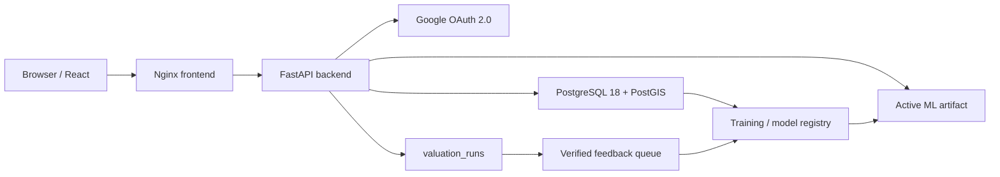

# Real Estate AVM - Production Operations Manual

> Phiên bản: 2.0 | Cập nhật: 2026-06-21 | PostgreSQL head: `20260621_0009`
>
> Đây là tài liệu vận hành chuẩn duy nhất. Số liệu runtime phải lấy lại bằng command trong tài liệu, không sao chép số cũ từ báo cáo lịch sử.

## 1. Mục tiêu hệ thống

Real Estate AVM định giá bất động sản theo bốn đầu ra:

- Fair market value.
- Quick sale value.
- Recommended listing value.
- Optimistic ask value.

Mỗi request còn trả confidence, comparable properties, adjustment ledger và lineage của model. Hệ thống hỗ trợ account user/admin, Google OAuth 2.0 PKCE, lịch sử dự đoán, phản hồi giá thực tế và retraining có kiểm soát.

## 2. Kiến trúc production



Runtime production không dùng SQLite. `DATABASE_URL` chỉ chấp nhận `postgresql+psycopg://` và test contract sẽ fail nếu SQLite quay lại source/config.

## 3. Cấu trúc repository

| Đường dẫn | Vai trò |
|---|---|
| `src/backend` | FastAPI, auth, API v2, DB session và service |
| `src/domain` | Valuation, comparable, fit và business rules |
| `src/ml` | Feature engineering, train, predict và model cache |
| `frontend` | React 18, Vite, route theo role và UI dự đoán |
| `alembic` | Nguồn duy nhất quản lý schema PostgreSQL |
| `models` | Active pointer, model artifacts và metadata |
| `scripts` | Backup, audit, retrain, import và MLOps commands |
| `scripts/quality` | Tạo/validate production test workbook |
| `tests/unit` | White-box/unit/contract tests |
| `tests/integration` | PostgreSQL + FastAPI integration tests |
| `tests/production` | Ba suite demo release gate có scenario trong file |
| `docs/testing` | Test catalogue Excel và hướng dẫn QA |
| `.github/workflows` | CI production và SonarCloud quality gate |

Không đặt script dùng một lần ở root. One-time migration phải đi qua Alembic; script data repair chỉ được giữ khi có tính lặp lại, idempotent và có runbook.

## 4. Environment và secrets

Tạo local env từ `.env.example`. Không commit secret thật.

Biến bắt buộc:

| Biến | Ý nghĩa |
|---|---|
| `DATABASE_URL` | PostgreSQL psycopg URL |
| `JWT_SECRET_KEY` | Ký access token; dùng secret ngẫu nhiên đủ dài |
| `RESEARCH_LAB_ACCESS_CODE` | Mã bảo vệ admin research operations |
| `POSTGRES_DB` | Database name cho Docker Compose |
| `POSTGRES_USER` | App role cho Docker Compose |
| `POSTGRES_PASSWORD` | Password từ secret store |

Google OAuth:

| Biến | Ý nghĩa |
|---|---|
| `GOOGLE_OAUTH_CLIENT_ID` | OAuth client ID |
| `GOOGLE_OAUTH_CLIENT_SECRET` | OAuth secret, chỉ ở local secret/GitHub Secrets |
| `GOOGLE_OAUTH_REDIRECT_URI` | Callback backend nằm trong allowlist |
| `GOOGLE_OAUTH_FRONTEND_REDIRECT` | Frontend redirect sau callback |

OAuth dùng authorization code, PKCE S256, state một lần, redirect allowlist và secure cookie theo môi trường. Khi thiếu config, endpoint trả 503 và không fallback credential hardcode.

## 5. PostgreSQL domain layout

Migration `20260621_0009` giữ `public` gọn và tách domain:

| Schema | Bảng/view | Mục đích |
|---|---:|---|
| `public` | 9 tables | Property, valuation, provenance, sources, expert và demand core |
| `auth` | 3 tables | Account, session và refresh token đã hash |
| `ml` | 4 tables | Dataset version, training run/metric và model registry |
| `community` | 11 tables | Claim/evidence/challenge/reputation; tách khỏi AVM core |
| `operations` | 2 tables | Audit log và migration quarantine |
| `management` | 6 views | PgAdmin/operator views dễ đọc |

Không gộp các bảng Community vào JSON chỉ để giảm table count. Chúng đang được API/UI tham chiếu và có FK riêng. Tách schema giảm nhiễu cho vận hành nhưng vẫn giữ integrity.

Các bảng core trong `public`:

| Bảng | Giá trị vận hành |
|---|---|
| `properties` | Dataset bất động sản và evidence tier |
| `valuation_runs` | Nguồn duy nhất lưu mọi dự đoán, latency, account, model, input/output, feedback và training usage |
| `provenance_chains` | Chuỗi bằng chứng cho từng property |
| `collection_sources` | Nguồn thu thập được phê duyệt và trạng thái |
| `expert_properties` | Property được chọn cho expert validation |
| `expert_ratings` | Ground-truth review từ expert |
| `buyer_requirements` | Demand input từ người mua |
| `matched_pairs` | Supply-demand matches |
| `alembic_version` | Revision hiện hành |

Management views nên dùng trong pgAdmin:

| View | Nội dung |
|---|---|
| `management.database_catalog` | Schema, object, row estimate, size và purpose |
| `management.property_dataset_full` | Dataset property đầy đủ |
| `management.prediction_history` | Prediction/account/model/feedback lineage |
| `management.training_feedback_candidates` | Feedback verified đủ điều kiện xem xét retrain |
| `management.model_registry` | Model active/candidate, metric và dataset lineage |
| `management.training_history` | Run, split, checksum và test metrics |

Audit exact row count:

```bash
python scripts/audit_postgres_catalog.py --exact-counts
python -m alembic current
```

Snapshot đã xác minh ngày 2026-06-21:

- `properties`: 3,560.
- Training eligible: 3,269.
- Verified: 2,844.
- `valuation_runs`: 349.
- `provenance_chains`: 9,889.
- Active model: `20260504_144753`.
- Active MAPE: 16.086434 percent.
- Active MAE: 776,510,800.70 VND.
- Active R2: 0.844868.

## 6. Prediction và feedback loop

Luồng mới dùng `POST /api/v2/valuation`:

1. Validate payload và quyền account.
2. Chọn active model bằng `models/ACTIVE_MODEL.json`, không lấy candidate mới nhất.
3. Chạy comparable, adjustment, confidence và prediction.
4. Ghi một row vào `public.valuation_runs` cùng `request_id` unique.
5. User xem lại qua `GET /api/v2/valuation/runs` theo RBAC.
6. Feedback giá thực tế phải có source/evidence.
7. Admin verify feedback.
8. `management.training_feedback_candidates` chỉ hiện row đủ quality gate.
9. Training run ghi lineage trước khi model được xem xét promote.

`POST /api/predict` là compatibility route deprecated. Không tạo lại bảng `predictions` hoặc `prediction_history`; history duy nhất là `valuation_runs`, còn `management.prediction_history` chỉ là view.

## 7. ML release policy

Ba con số 16.09, 31-44 và khoảng 14.20 thuộc các artifact/run khác nhau:

- Production `20260504_144753`: MAPE 16.0864, MAE 776.5M, R2 0.8449, n_test 485.
- Historical `20260503_185414`: MAPE khoảng 14.1962 nhưng MAE cao hơn, R2 thấp hơn và n_test nhỏ hơn; không phải active.
- Candidate `20260621_162930`: MAPE 44.3777, MAE 3.463B, R2 0.5947; bị giữ ở candidate.

Không được kết luận model tốt hơn chỉ từ MAPE nếu dataset/split/checksum khác. Promotion yêu cầu:

1. Dataset version và checksum có thật.
2. Exact train/validation/test manifest.
3. Không leakage.
4. So metric trên cùng holdout hoặc có mapping chênh lệch được review.
5. MAPE, MAE, R2, n_test và stability cùng đạt policy.
6. Artifact + metadata tồn tại và hash hợp lệ.
7. Candidate không tự thay `ACTIVE_MODEL.json`.

Commands:

```bash
python scripts/retrain_v2.py --dry-run
python scripts/retrain_v2.py
python scripts/sync_ml_registry.py
pytest tests/production/test_ml_release_gate.py -vv
```

## 8. Docker production stack

Compose gồm:

- `postgres`: PostgreSQL 18/PostGIS, private network và persistent volume.
- `migrate`: Alembic one-shot, chạy sau DB healthy.
- `backend`: non-root, read-only root filesystem, private network, healthcheck.
- `frontend`: Nginx public port 80, proxy `/api` tới backend.

Backend Dockerfile là multi-stage. Compiler và header chỉ ở builder; runtime chỉ giữ venv, `libpq5`, `libgomp1`, curl và source cần chạy. Test tooling nằm trong `requirements-dev.txt`, không đóng gói production.

Frontend Dockerfile chạy `npm run build:check`, tức là build production xong phải vượt bundle budget gate trước khi image được tạo. Gate hiện khóa app shell, Prediction, Login, visualizer shell, 3D dynamic entry, `react-three` lazy vendor và `three-core` lazy vendor.

```bash
docker compose --env-file .env.postgres.local config --quiet
docker compose --env-file .env.postgres.local build
docker compose --env-file .env.postgres.local up -d
docker compose --env-file .env.postgres.local ps
curl http://127.0.0.1/api/health
docker compose --env-file .env.postgres.local logs --no-color backend migrate
```

Stop không xóa volume:

```bash
docker compose --env-file .env.postgres.local down
```

Chỉ dùng `down --volumes` cho disposable local/CI database đã được xác nhận.

## 9. Local development

```bash
python -m venv .venv
.venv/Scripts/python -m pip install -r requirements-dev.txt
.venv/Scripts/python -m alembic upgrade head
.venv/Scripts/python -m uvicorn src.backend.main:app --reload --port 8000
```

Frontend:

```bash
cd frontend
npm ci
npm run dev
npm run build:check
```

## 10. Automated testing

Full local gate:

```bash
python -m pytest tests -q
cd frontend && npm run test:unit && npm run build:check
python scripts/quality/validate_test_catalog.py
docker compose --env-file .env.postgres.local config --quiet
```

Ba suite chạy trực tiếp khi demo/review:

```bash
pytest tests/production/test_database_release_gate.py -vv
pytest tests/production/test_api_release_gate.py -vv
pytest tests/production/test_ml_release_gate.py -vv
```

Mỗi file có happy path, failure path, expected result, recovery và command evidence trong module docstring.

## 11. Production test workbook

`docs/testing/AVM_Production_Test_Cases.xlsx` có:

- 122 master test cases với ID duy nhất.
- 122 happy scenarios.
- 244 failure scenarios.
- Automation mapping.
- Execution evidence theo build/commit SHA.
- Requirement Traceability Matrix.
- Release gate và audit closure.

Validator:

```bash
python scripts/quality/validate_test_catalog.py \
  --report reports/test-catalogue-validation.json
```

P0 không được ở Design Status `Planned`. P0 manual phải có owner, reviewer, ngày chạy, môi trường và evidence. `Automated` không đồng nghĩa `Passed`.

## 12. GitHub Actions và evidence

`.github/workflows/ci.yml` chạy:

1. Backend tests trên PostgreSQL 18/PostGIS, Alembic fresh migration, JUnit và coverage XML.
2. Frontend npm audit, unit JUnit, production build, bundle budget JSON và bundle sizes.
3. Workbook structural/traceability validator.
4. Blocking `pip-audit`.
5. Docker build, migration và health smoke thật.

Artifact evidence được upload 30 ngày và gắn commit SHA:

- `backend-test-evidence-*`.
- `frontend-test-evidence-*`.
- `test-catalogue-evidence-*`.
- `dependency-security-evidence-*`.
- `docker-smoke-evidence-*`.

`.github/workflows/third-party-quality.yml` gọi SonarCloud. Repository cần `SONAR_TOKEN`; thiếu token làm gate fail rõ. Required branch checks nên gồm Production CI và Third-party Quality Gates.

## 13. Performance SLO

Mục tiêu interactive API/cache-hit là p95 dưới 200 ms. Prediction nặng phải đo riêng theo endpoint, dataset và concurrency; không dùng health latency để khẳng định toàn hệ thống.

Frontend budget hiện tại:

- App shell initial JS: <= 480 KB.
- Prediction page JS: <= 170 KB.
- Login page JS: <= 40 KB.
- Property visualizer shell: <= 40 KB.
- 3D dynamic entry: <= 40 KB.
- React-three lazy vendor: <= 220 KB.
- Three core lazy vendor: <= 700 KB.

```bash
python scripts/load_test.py --url http://127.0.0.1:8000 --endpoint /api/v2/pipeline --requests 100 --concurrency 10 --threshold-ms 200 --report reports/ci/prediction-latency.json
pytest tests/production/test_api_release_gate.py -vv
```

Khi vượt SLO:

1. Giữ request/correlation ID và p50/p95/p99.
2. Tách thời gian middleware, DB query, model load và serialization.
3. Kiểm tra cache hit, DB indexes, connection pool và N+1 query.
4. Tối ưu rồi chạy lại đúng workload; không đổi threshold để làm xanh.

## 14. Backup và restore

Backup PostgreSQL:

```bash
python scripts/backup_postgres.py
```

Trước migration lớn:

1. Tạo `pg_dump` và ghi checksum.
2. Ghi Alembic revision hiện tại.
3. Test restore trên database disposable.
4. Chạy migration trong transaction.
5. Chạy production DB test và catalog audit.

Không dùng file `.db` làm backup production.

## 15. Security controls

- Không hardcode OAuth/DB/JWT secret.
- Refresh token lưu hash và rotate.
- Session/token có revoke.
- RBAC kiểm tra ở API, không chỉ ẩn UI.
- Rate limit và safe error message.
- Nginx security headers.
- Container backend non-root, read-only và `no-new-privileges`.
- `pip-audit`, `npm audit` và SonarCloud là blocking gates.
- Log không ghi password, raw JWT, OAuth code hoặc client secret.

Khi nghi lộ secret: revoke/rotate trước, sau đó mới sửa history/config; tạo incident evidence không chứa secret gốc.

## 16. Release checklist

1. Git working tree phản ánh đúng commit cần release.
2. Alembic fresh DB lên head `20260621_0009` hoặc revision mới hơn đã review.
3. Backend, frontend, catalogue, security và Docker jobs pass.
4. SonarCloud quality gate pass.
5. P0 execution evidence có commit SHA; không Failed/Blocked/Not Run nếu release production.
6. Active model pointer, DB registry và artifact khớp.
7. Backup/restore test gần nhất còn hiệu lực.
8. OAuth redirect và secrets đã cấu hình theo environment.
9. Docker health smoke pass.
10. Release reviewer sign-off.

## 17. Known constraints

- Community domain hiện chưa có production rows nhưng API/UI vẫn sử dụng, nên được tách schema thay vì xóa.
- Một số candidate lịch sử thiếu exact split checksum; chỉ dùng tham khảo, không dùng comparison gate trực tiếp.
- P0 manual trong workbook vẫn cần staging evidence trước production release.
- SonarCloud không chạy nếu repository chưa cấu hình `SONAR_TOKEN`.
- GitHub Actions chỉ có evidence sau khi commit được push lên remote và workflow hoàn tất.
